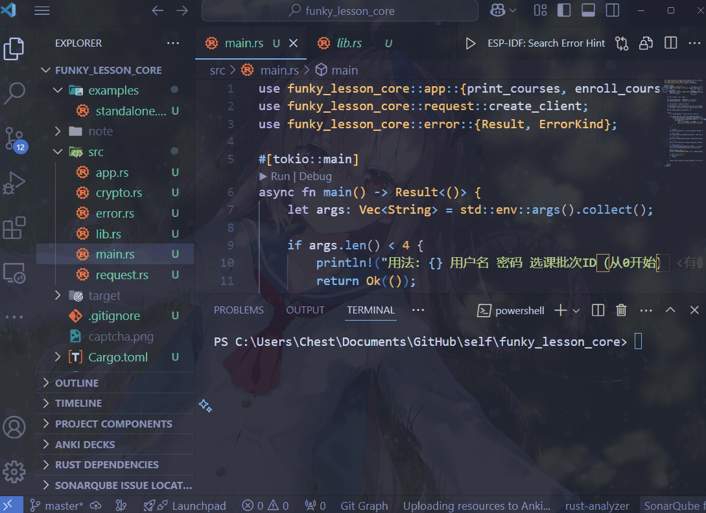

# Funky Lesson Core

Rust写的吉林大学抢课脚本



funky-lesson的核心库部分

funky_lesson_core是基于[MoonWX从H4ckF0rFun同学那里Fork下来的Fuck-Lesson](https://github.com/MoonWX/Fuck-Lesson)（一个python单文件抢课脚本）重写而成的Rust库（在examples文件夹下的standalone.rs包含了rust的单文件实现(但我去掉了ocr部分，感觉不太必要)，而src里面则是我封装和适配app之后的版本）

# Acknowledgement

无论是MoonWX同学还是H4ckF0rFun的Fuck-Lesson仓库都没有挂证书，只能在这里口头Acknowledgement了（

原python脚本原封不动放在raw.py里面了


# Developer Usage

0. 确保电脑配好了rust环境，没有的话去[https://www.rust-lang.org/learn/get-started](https://www.rust-lang.org/learn/get-started)配一下
1. 先在网站上把要选的课加进收藏列表
2. 执行下面的命令

```shell
cargo run <username> <password> <选课轮次，从0开始记数> <是否循环（填个数就开，不填不开）>
```

例如
```shell
cargo run 114514 1919810 0 1
```

然后验证码图片captcha.png会保存到当前目录，在终端里面正确输入就行(不分大小写)

然后就开始自动刷新了

# Windows EXE Usage

1. 先在网站上把要选的课加进收藏列表
2. 从release里面下载好exe
3. 在同文件夹的终端执行
```shell
./funky_lesson_core.exe <username> <password> <选课轮次，从0开始记数> <是否循环（填个数就开，不填不开）>
```

例如
```shell
./funky_lesson_core.exe 114514 1919810 0 1
```

然后验证码图片captcha.png会保存到当前目录，在终端里面正确输入就行(不分大小写)

然后就开始自动刷新了

# 温馨提醒

程序不能保证100%抢中课，并不是运行脚本就能高枕无忧，那个选课服务器并不太稳定，严重的网络中断可能随时发生

如果脚本无响应，请不要放弃去用浏览器手动刷新拼运气选课